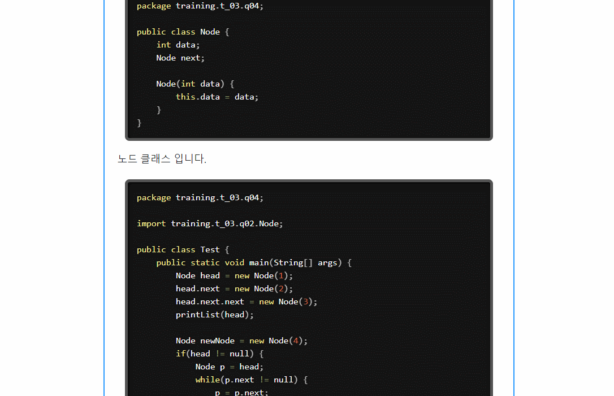

# 코딩백서

## 개요

누구나 쉽게 코드 관련 질문을 올릴 수 있고,
누구나 코드 리뷰어가 되어 자신의 지식을 공유할 수 있는 공개 코드 리뷰 사이트

## 개발 환경

    ** Server Side **
        WAS : TomCat 8.5
        DB : MySQL 5.7
        Character Set : UTF - 8
        JDK : 1.8.0_181
        Framework : Spring 4.3.18.RELEASE
    
    ** Client Side **
        Web Browser : Chrome

## 프로젝트 주요 기능 화면 :

- 질문 등록

    
  
- 답변 등록

    
  
- 댓글 등록

    
  
- 랭킹

    
